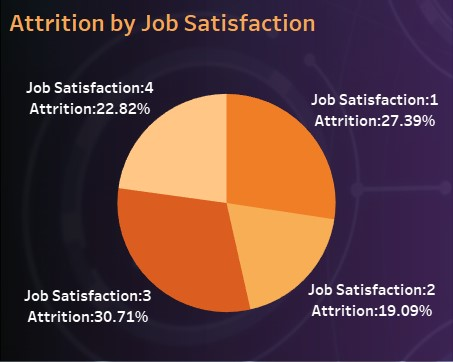

# HR Analytics Dashboard

Dashboard to show HR about the various features regarding the attrition of employees in the company. The dashboard can be filtered by departments to show attrition within each department or overall attrition. The dashboard is published on Tableau server and looks like as shown below.

  

 

## Components
**Attrition by Job Satisfaction:**&nbsp;

  &nbsp;&nbsp;
  - The sum of Attrition dimension is added as the angle of the pie-chart.
  - Job Satisfaction dimension is filled in the pie-chart with arranging required colors from the marks pane.
  - Tooltip and title are adjusted accordingly.
 
 

**Attrition by Performanct Rating:**&nbsp;

  &nbsp;&nbsp;
  - The sum of Attrition dimension is added in the rows field.
  - Performace Rating and monthly income dimensions are added in the columns field, with the former as a dimension instead of a measure.
  - The bar chart are filled with hue of the monthly income by putting it in colors field in the marks pane.
  - Tooltip and title are adjusted accordingly.
 
 

**No. of Employees by Age:**&nbsp;

  &nbsp;&nbsp;
  - The sum of Attrition dimension is added in the rows field.
  - Created age bins by using the age column and used the parameter to create a slider to change bin size.
  - Tooltip and title are adjusted accordingly.
 
 

**Attrition by % Salary Hike:**&nbsp;

  &nbsp;&nbsp;
  - The sum of Attrition dimension is added in the columns field.
  - Created percentage salary hike bins by using the percentage salary hike column and used the parameter to create a slider to change bin size.
  - Tooltip and title are adjusted accordingly.
 
 

**Attrition by Age Group/Gender:**&nbsp;
  
  - Create age bands from the age dimension, and put it in columns field.
  - Filled the angle of the pie chart with attrition and put gender in the color marks pane.
  - Tooltip and title are adjusted accordingly.
